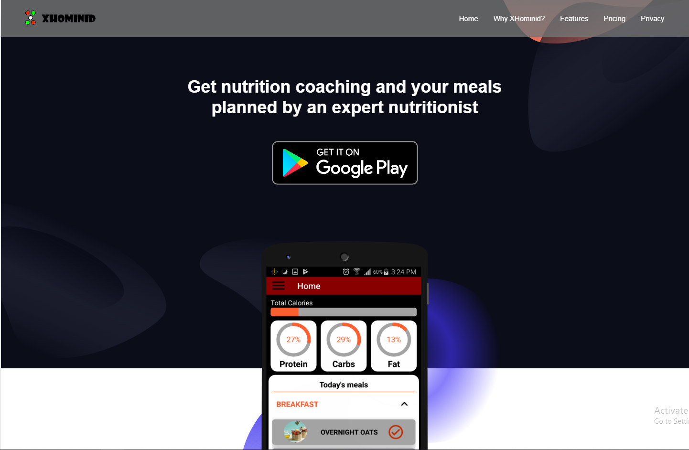

# &nbsp; [XHominid](http://www.xhominid.com/) Web App

A Flask website and Backend server for an Android nutrition coaching and meal planning app.

check out XHominid on google play: &nbsp;&nbsp;&nbsp;&nbsp; [](https://play.google.com/store/apps/details?id=com.main.android.activium&pcampaignid=MKT-Other-global-all-co-prtnr-py-PartBadge-Mar2515-1)

Also check out the [**android app github repo**](https://github.com/h-amg/XHominid-Android-App)

## Introduction

XHomind is a platform that helps people looking for nutrition coaching and meal planning get connected with a qualified professional nutritionist. The platform enables professional nutritionists to conduct nutrition assessment interviews through XHomind video call feature. After this assessment the user then gets access to weekly meal plans prepared by the nutritionist, they are then able to directly message the nutritionist for further questions via XHominid messaging feature. In order to maintain continuous progress the users are able to book weekly one to one coaching sessions with their nutritionist via the video call booking feature. The user is able to view meal information, recipes and cooking instructions as well as mark meals eaten throughout the day. The daily nutritional intake logs are uploaded instantly and made accessible to the user nutritionist so that the can advice and guide them when needed and make improvements to the upcoming weeks' plan.

## Screenshot


---

## Components

### [Webhook](app/mod_webhook) module
- Handles user onboarding, collects the necessary data required to design a diet plan and calculates the daily micro-nutrients intake required for the user to achieve their desired nutritional goal.
- Retrieves macro-nutrients data  about a specific food item from [Edamam](https://developer.edamam.com/) nutrition database Api and returns the result to client App.
- Updates user cuurent weight or target weight and produces the appropriate progress feedback that gets diplayed by client App.
- Checks user dietary intake and verifies whether a specific food item can be had without exceeding the daily micro-nutrients intake limit.
- Logs micro-nutrients of food items consumed by the user and calculates the remaining permissible micro-nutrients amount for the rest of the day.

### [User](app/mod_user) module
- Logs the website administrator and nutritionists in and out.
- Displays the administrator dash board after authentication, which enables the admin to view/downlaod email sign-ups from the landing page.
- Displays the nutritionists' dashboard after authentication, which enables them to conduct counseling sessions through video calls.

### [Twilio](app/mod_twilio) module
- Retrieves Twilio chat access token from twilio backend server.
- Retrieves Twilio video access token from twilio backend server.

### [Main](app/mod_main) module
- Displays the index, promotion and privacy policy pages.
- Collects user emails from the index page and promotion sign up forms and saves it to the database.
- Collects and sends analytics data to Mixpanel.

### [Billing](app/mod_billing) module
- Verifies and valiadte purchase tokens received from client.
- Updates purchases and subscriptions record on the database.
- Updates user susbscription status and expiry date.

### [API](app/mod_api) module
- Exposes an Api endpoint for email signups that collects signee email and saves it to the database.

### Acknowledgements
In developing this project I used and modified a boilerplate open source [flask App: Flask-Landing](https://github.com/mjhea0/Flask-Landing) by [Michael Herman](https://github.com/mjhea0)

### Blog
Check out my medium blog post [**From zero to published**](https://medium.com/@husamgibreel_91278/from-zero-to-published-7d9ba9de926a?source=friends_link&sk=19518dcd3eeff403237149fb00d716c9) about my exoerience building this project and the challenges that came along with it.

---

## Setup

### Installation

1. Clone thisn repo 
1. Create and activate a virtual environment
1. Install the dependencies using [requirements.txt](requirements.txt)

### Configure Flask
#### Go to [config.py](app/config.py):
- Specifiy a secret key that will be used to encrypt your cookies.
- specifiy your database URI to configure flask to work with your SQL database.

#### Set Environment Variables

During the local development process you can use the default configuration:

```sh
$ set APP_SETTINGS=app.config.DevelopmentConfig
```
When ready to deploy and after modifiting the production configurations in [config.py](app/config.py) you can use this variable:
```sh
$ set APP_SETTINGS=app.config.ProductionConfig
```
If you're using google's *cloud SQL* set this env. variable to the path of your json credential file to give flask access to you database:

```sh
$ set GOOGLE_APPLICATION_CREDENTIALS=silent-base-230717-54ef7bc5ff66.json
```

#### Create DB for local development

```sh
$ python manage.py create_db
$ python manage.py db init
```
Initiate models/tables.
```sh
$ python manage.py db migrate 
```
Create default admin credentials and data values. Found [here](manage.py).
```sh+
$ python manage.py create_admin 
$ python manage.py create_data
```

#### Migrating DB

Update DB with new models as found in [app/models.py](app/models.py).
```sh
$ python manage.py db migrate
$ python manage.py db upgrade
```

#### Run server

```sh
$ python manage.py runserver
```

#### Run tests

Without coverage:

```sh
$ python manage.py test
```

Without coverage and limited to a module inside "tests" directory

```sh
$ python manage.py test --test_name=test_endpoints
```

With coverage:

```sh
$ python manage.py cov
```